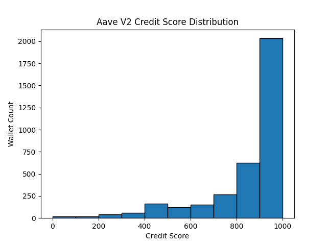

# Credit Score Analysis for Aave V2 Wallets

This document provides a summary of wallet behavior based on the credit scores (0–1000) assigned using transaction history from the Aave V2 protocol on Polygon.

---

## Objective

The goal of this analysis is to:
- Understand how wallets are distributed across credit score buckets.
- Analyze behavioral patterns in both high and low scoring wallets.
- Validate whether the scoring system effectively separates risky and responsible behavior.

---

## Credit Score Distribution

Credit scores were binned into 10 ranges for clarity. The distribution below reflects how wallets are spread across these ranges:

| Score Range | Wallet Count |
|-------------|---------------|
| 0–100       | 17            |
| 100–200     | 21            |
| 200–300     | 41            |
| 300–400     | 61            |
| 400–500     | 161           |
| 500–600     | 124           |
| 600–700     | 151           |
| 700–800     | 266           |
| 800–900     | 627           |
| 900–1000    | 2028          |

### Score Distribution Plot



The histogram shows how scores are spread across all wallets. Most wallets cluster in the 600–900 range, indicating generally responsible behavior, while a tail on the lower end captures riskier activity.

---

## Behavioral Analysis

### Wallets in the 0–300 Range (Low Scores)

These wallets generally show **risky or abnormal** behavior, including:

- **High liquidation ratios**: e.g. 2+ liquidations with few or no repayments.
- **Heavy borrowing without repaying**: suggests overleveraging or abandonment.
- **Very short activity windows**: e.g. all actions within the same day.
- **Bot-like patterns**: rapid sequences of deposits and redeems across assets.
- **No deposit behavior**: interacting only via borrow or liquidation.

#### Example Behavior (Low Score Wallet)
```json
{
  "wallet": "0xabc...",
  "num_borrows": 12,
  "num_repays": 0,
  "num_liquidations": 5,
  "activity_days": 1,
  "repay_to_borrow_ratio": 0.0
}
